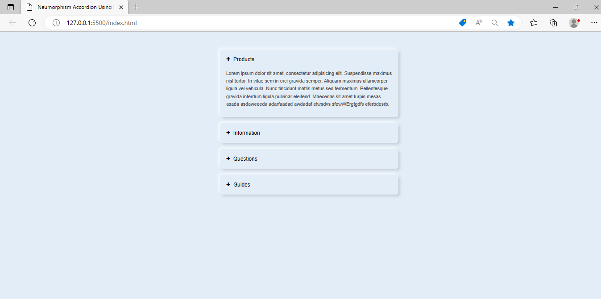

# sacode-online-day11
How To Make An Accordion Using HTML And CSS | Collapsible Content On Website”

## Github Pages
Berikut ini Link Github Pages :
https://amelialudia.github.io/sacode-online-day11/

## Hasil Screenshoot 
Berikut ini gambar dari hasil Tugas  Day 11 :

